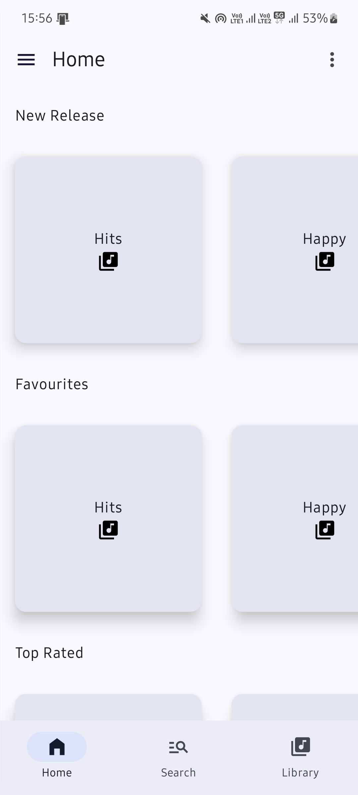
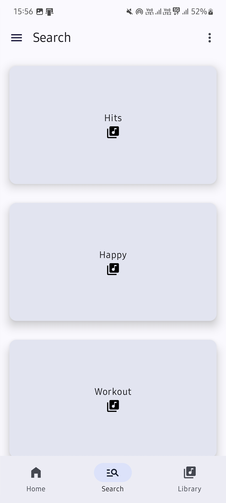
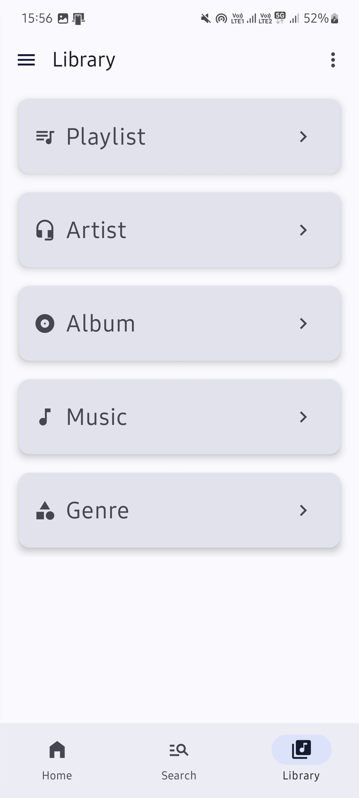
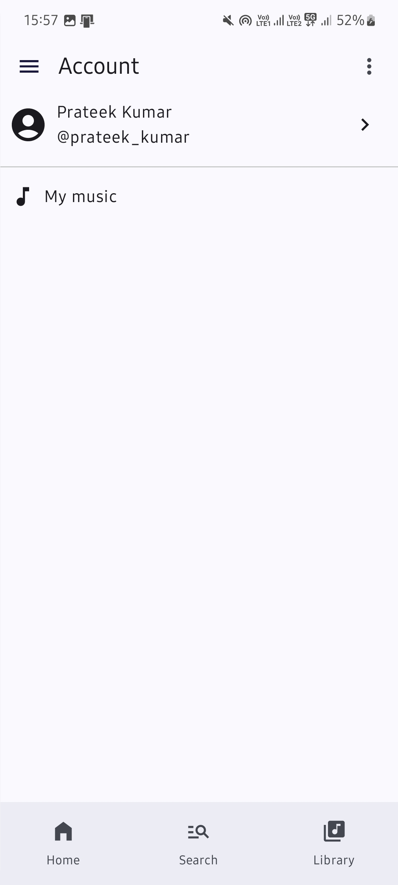
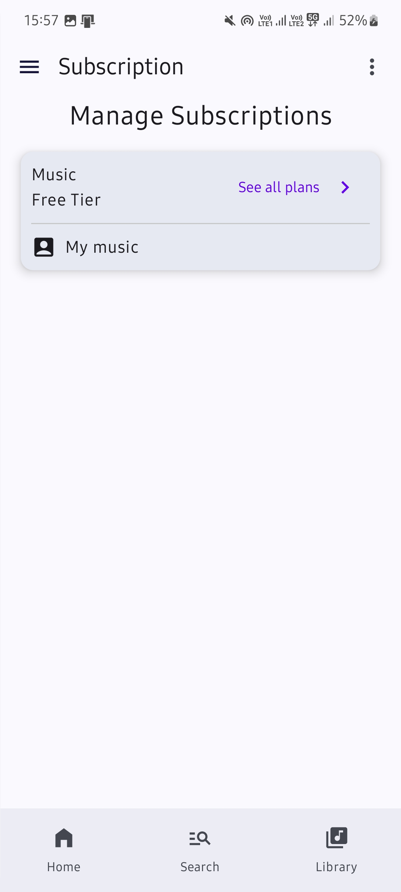
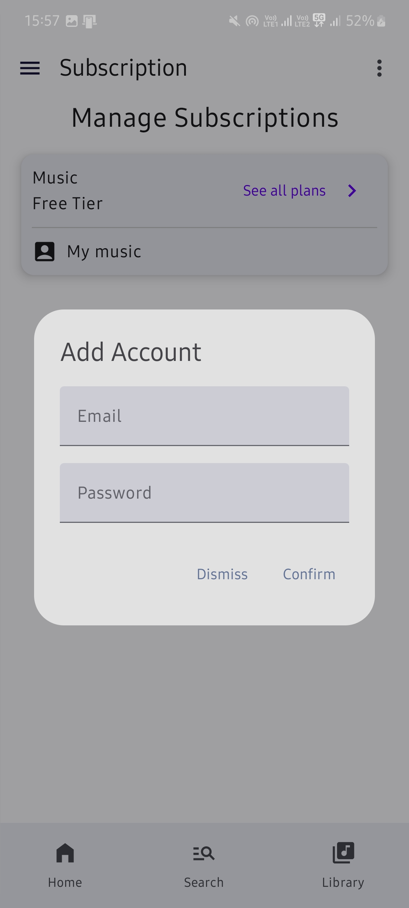

#**MusicApp UI**

Overview

MusicApp UI is a beautifully designed user interface for a music application. Developed in Android Studio, this app showcases modern design principles and provides a smooth user experience. Currently, it includes the front-end UI components without backend functionalities.

##**Table of Contents**

- [Features](#features)
- [Installation](#installation)
- [Usage](#usage)
- [Screenshots](#screenshots)
- [Contributing](#contributing)

##**Features**

-Home screen with a list of music tracks.
-Detailed view for each music track.
-Navigation drawer for easy access to different sections.
-Responsive design suitable for different screen sizes.


###**Installation**

-Clone the repository:

```sh
git clone https://github.com/yourusername/musicapp-ui.git

_Open Android Studio and select Open an existing project.

-Navigate to the cloned repository and open it.

-Build and run the project on an emulator or connected device.

###**Usage**

To navigate through the app, use the navigation drawer to access different sections like Home, Playlists, and Settings. Explore the list of music tracks on the Home screen and tap on a track to view its details.

###**Screenshots**








###**Contributing**

-Fork the repository.
-Create a new branch (git checkout -b feature-branch).
-Commit your changes (git commit -m 'Add some feature').
-Push to the branch (git push origin feature-branch).
-Open a Pull Request.
